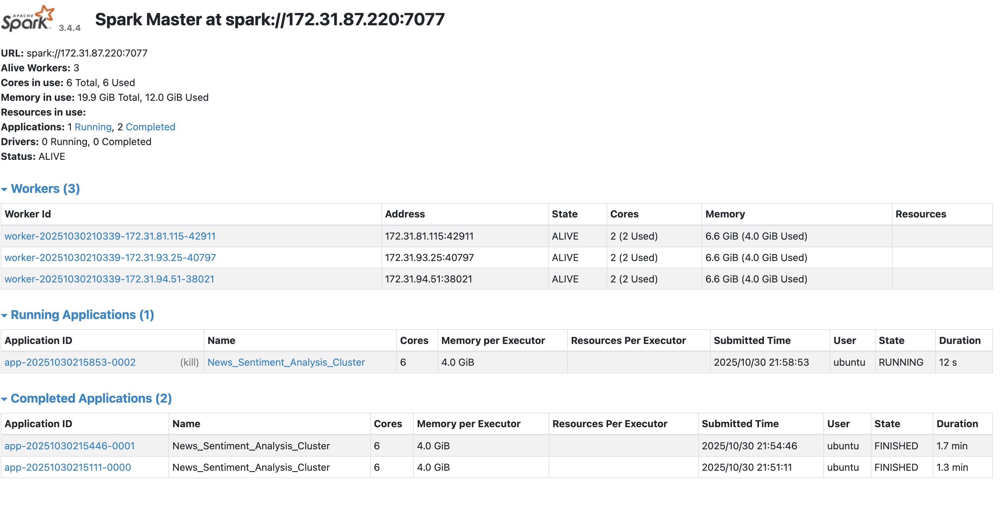
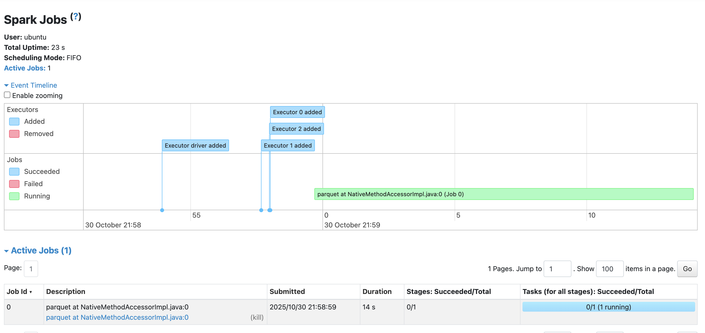

## Approach
I started developing locally on the sample dataset, using a simple Spark session. I used Spark SQL commands instead of Polars so it could be easily scaled to the cluster.

After initially considering creating two different Spark sessions (since the second problem required a more narrowly-tailored initialization for the SparkNLP pipeline), I decided instead that it would be better to only initiate a Spark session and read in the data once and, passing the results obtained from the first problem into the second problem for analysis.

## Key Findings / Topic Distribution
* The most common topic was arts, which surprised me. I suspect that the inclusion of "photography" may have resulted in too many false positives if this phrase was commonly used in photo captions. 
* Sports was the next-most common topic, followed by politics and then history.
* Articles about politics and not mentioning politics both had around a 2:1 ratio of negative to positive sentiment.

## Performance Observation
* The second task took less time than the first one, which surprised me. My guess is that the regex expressions, which ran four times per article, may have taken about as much time or longer than the sentiment analysis. Thus, it would make sense that the sentiment analysis would not take as much time.

## Appendix: Screenshots of Spark UI

Here we can see the master node and three worker nodes.

And here, we see the process of running the .py file.
