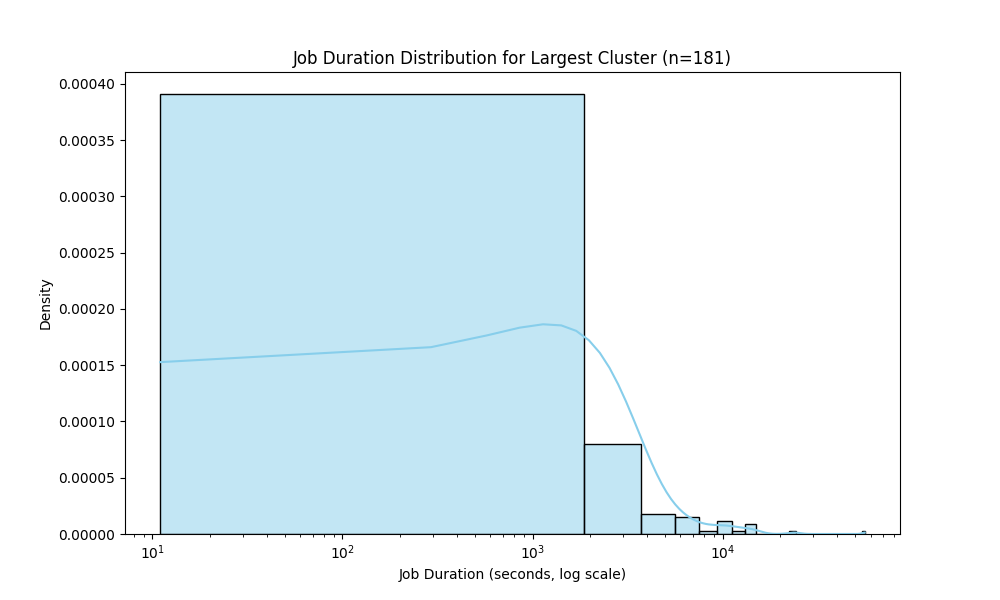

## Problem 1
For Problem 1, I decided to execute all steps within a singuular main function. After reading in all the log files from my S3 bucket into a Spark DataFrame, I used the parsing function provided in the original repository to extract the log level. I took the additional step of filtering out logs that did not contain a level, although I did keep a copy of the full log DataFrame for the summary statistics. Based on this DataFrame, I was able to complete Part 1 (count of logs by log level), Part 2 (a sample of logs), and Part 3 (summary statistics).

## Problem 2
For Problem 2, I decided to split up the steps of computing data summaries and producing the visualizations. For the time series data, I first grouped by application_id, computed the start and end times of each application based on the timestamp provided in the log data, and then extracted the application number and cluster id from the application_id field to match the example output. Then, I took this dataset and grouped by cluster to calculate the total number of apps and the start and end time of each cluster. Finally, I was able to derive counts from the number of rows in my application and cluster datasets to generate the summary statistics. While I had the DataFrame handy, I created pandas DataFrames for each of the visualizations I would need to use in my next steps.

## Key Findings
* The vast majority of log entries are INFO and not ERROR or WARN. This suggests a data workflow that was largely performing as expected
* There were about 6 million log entries without a level.
* The cluster starting in January 2017 had the most applications by far (see Bar Chart), and the vast majority of its jobs took less than 15 minutes (see histogram).
* The averge number of applications per cluster is heavily skewed towards higher values since the January 2017 cluster has 181 applications.

## Performance Observations
* I was not expecting the third summary step to take the longest for part 2, but it seems like this took the longest of all the different processes.

## Graph 1: Bar Chart 

This chart displays the number of applications that were run on each cluster in our dataset. Tje vast majority of data comes from a single cluster

## Graph 2: Distribution of Job Time within Cluster

This chart shows a histogram of the duration of job lengths for the most-used cluster. The vast majority were shorter jobs, in the very wide bin covering jobs which lasted less than 1000 seconds (15 minutes). There were a few jobs that took more than 10000 seconds, which means hours of running even on a large cluster like this.

## Appendix: Spark UI

Here we see a master node and three worker nodes, which form the cluster used to complete problems 1 and 2.

